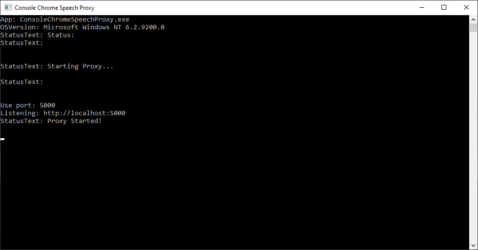

# UnityWebGLSpeechDetection

The `WebGL for Speech Detection` package is available in the [Unity Asset Store](https://www.assetstore.unity3d.com/en/#!/content/81076). [Online documentation](https://github.com/tgraupmann/UnityWebGLSpeechDetection) is available.

# Attention:

* Browsers made a recent update that throws exception when starting detection. You will need to update the JavaScript library with the latest fix. [Assets/Plugins/WebGL/WebGLSpeechDetectionPlugin.jslib](https://github.com/tgraupmann/UnityWebGLSpeechDetection/blob/master/Assets/Plugins/WebGL/WebGLSpeechDetectionPlugin.jslib)

# See Also

* The `WebGL for Speech Synthesis` package is available in the [Unity Asset Store](https://www.assetstore.unity3d.com/en/#!/content/81861). [Online documentation](https://github.com/tgraupmann/UnityWebGLSpeechSynthesis) is available.

* The `WebGL Speech` package is available in the [Unity Asset Store](https://assetstore.unity.com/packages/tools/audio/webgl-speech-105831).
[Online documentation](https://github.com/tgraupmann/UnityWebGLSpeech) is available.

* Try the [Unity WebGL Speech Demos](https://theylovegames.com/UnityWebGLSpeech_Demos/)

# Supported Platforms

* WebGL

* Mac Standalone (using [Speech Proxy](https://github.com/tgraupmann/ConsoleChromeSpeechProxy))

* Mac Unity Editor (using [Speech Proxy](https://github.com/tgraupmann/ConsoleChromeSpeechProxy))

* Windows Standalone (using [Speech Proxy](https://github.com/tgraupmann/ConsoleChromeSpeechProxy))

* Windows Unity Editor (using [Speech Proxy](https://github.com/tgraupmann/ConsoleChromeSpeechProxy))

<table border="1"><tr><td>
Note: WebGL builds use the built-in browser to use the Speech API on PC/Mac/Android/iOS. In order to use the Speech API in standalone builds and in the Unity Editor, you will need to configure and run the free <a target="_blank" href="https://github.com/tgraupmann/ConsoleChromeSpeechProxy">Speech Proxy</a>.



The demo scenes have game objects to support the WebGL Plugins and the `Speech Proxy`.


With the `Speech Proxy` running, open a browser tab that relays `Speech API` calls to and from the browser.


Only the `WebGL Speech` package in the [Unity Asset Store](https://assetstore.unity.com/packages/tools/audio/webgl-speech-105831) has example scenes that show using `Speech Detection` and `Speech Synthesis` together.
</td></tr></table>

# Target

The `WebGL for Speech Detection` package is created for Unity version `5.3` or better. This includes support for Unity 2017.X, 2018.X, 2019.X, and 2021.X.
This package was originally created for the `WebGL` platform and supports other platforms using a `Speech Proxy`.
This package requires a browser with the built-in [Web Speech API](https://dvcs.w3.org/hg/speech-api/raw-file/tip/speechapi.html), like Chrome.
Detection requires an Internet connection.
Check the [browser compatibility](https://developer.mozilla.org/en-US/docs/Web/API/Web_Speech_API#Browser_compatibility) to see which browsers implemented the `Speech API`.

# Changelog

1.0 - Initial creation of the project

1.1 - Added support for `Speech Proxy`

1.2 - Minor fixes

1.3 - Added support for speech detection in edit mode

1.4 - Added support for `MacOS` for `play-mode` and `edit-mode`

1.5 - Added dictation and command examples without GUI

1.6 - Added buffering for language data

1.7 - Cleaned up sample code

1.8 - Updated sample scenes to use default 5000 port

1.9 - Added support for `2018.1` and `2019.1`.

1.10 - Added support for `2020.X`

1.11 - Added support for `2021.X`

1.12 - Added support for `iOS 16.3.1`

# Demos

[Demo 01 Unity Speech Dictation](https://theylovegames.com/UnityWebGLSpeechDetection_01Dictation/)

[Demo 02 Unity Speech Commands](https://theylovegames.com/UnityWebGLSpeechDetection_02SpeechCommands/)

# Documentation

This document can be accessed in `Assets/WebGLSpeechDetection/Readme.pdf` or use the menuitem `GameObject->WebGLSpeechDetection->Online Documentation`

# FAQ

* To avoid constant Microphone security prompts, host WebGL builds on secure HTTPS sites. Take a look at the online demos to see how that works.

* Speech can work on mobile as a WebGL build. Launch the Chrome browser app on mobile and load your WebGL page in the Chrome app.

* WebGL can take a long while to build. For faster development, try the [Speech Proxy](https://github.com/tgraupmann/ConsoleChromeSpeechProxy). This enables speech in the editor and standalone Windoows/Mac builds without the long wait times.

* Sometimes the browser speech mechanism can crash. It can happen. If speech stops working, just close all of the browser windows and relaunch which should fix the issue.

<table border="1"><tr><td>
Note: In December of 2018, Chrome added a speech restriction that the speak() method can't be invoked until a web page has some user interaction.

<https://www.chromestatus.com/feature/5687444770914304>
</td></tr></table>

# Sample Scenes

***These sample scenes are located in the `Assets/WebGLSpeechDetection/Scenes/` folder:***

1 `Example01_Dictation` - Uses WebGLSpeechDetectionPlugin to do speech dictation

2 `Example02_SpeechCommands` - Uses WebGLSpeechDetectionPlugin to do speech commands

3 `Example03_ProxyCommands` - Uses ProxySpeechDetectionPlugin to do speech commands

4 `Example04_ProxyDictation` - Uses ProxySpeechDetectionPlugin to do speech dictation

5 `Example05_ProxyManagement` - Management methods for launching and modifying the proxy

***These sample scenes are located in the `Assets/WebGLSpeechDetection/Editor/` folder:***

6 `Example06PanelDictation.cs` - Unity editor panel for speech dictation that works in play mode and edit mode

7 `Example07PanelCommands.cs` - Unity editor panel for speech commands that works in play mode and edit mode

***These sample scenes are located in the `Assets/WebGLSpeechDetection/Scenes/` folder:***

8 `Example08_NoGUIDictation` - Do dictation without a GUI

9 `Example09_NoGUISpeechCommands` - Do commands without a GUI

# Modes

Detection modes use the same API interface other than where the instance comes from.

## WebGL Mode

The `WebGLSpeechDetectionPlugin` uses native detection only for the WebGL platform.

```
ISpeechDetectionPlugin speechDetectionPlugin = WebGLSpeechDetectionPlugin.GetInstance();
```

`WebGL` mode requires a `WebGLSpeechDetectionPlugin` gameobject in the scene which can be created from the `GameObject->WebGLSpeechDetection->Create WebGLSpeechDetectionPlugin` menu item.

## Proxy Mode

The `ProxySpeechDetectionPlugin` uses a `Speech Proxy` to do speech detection for non-WebGL platforms.

```
ISpeechDetectionPlugin speechDetectionPlugin = ProxySpeechDetectionPlugin.GetInstance();
```

`Proxy` mode requires a `ProxySpeechDetectionPlugin` gameobject in the scene which can be created from the `GameObject->WebGLSpeechDetection->Create ProxySpeechDetectionPlugin` menu item.

Also a `Speech Proxy` needs to be running for `Proxy` mode to work.

The `Proxy Port` is assigned by the `ProxySpeechDetectionPlugin` gameobject with the inspector and needs to match the port used by the `Speech Proxy`.


## Edit Mode

The `EditorProxySpeechDetectionPlugin` uses a `Speech Proxy` to do speech detection for editor panels in the Unity editor.

```
ISpeechDetectionPlugin speechDetectionPlugin = EditorProxySpeechDetectionPlugin.GetInstance();
```


# Quick Start

1 Switch to the `WebGL` platform in `Build Settings [image_1](images/image_1.png)

2 Create one `WebGLSpeechDetectionPlugin` GameObject in the scene with the menu `GameObject->WebGLSpeechDetection->Create WebGLSpeechDetectionPlugin` [image_2](images/image_2.png)

3 (Optional) You may need a languages dropdown in your UI, use the menuitem `GameObject->WebGLSpeechDetection->Create Languages Dropdown` [image_3](images/image_3.png)

4 (Optional) You may need a dialects dropdown in your UI, use the menuitem `GameObject->WebGLSpeechDetection->Create Dialects Dropdown` [image_4](images/image_4.png)

5 At this point you should have a scene with the `WebGLSpeechDetectionPlugin`, and (optionally) a couple dropdown controls added to the canvas.


6 Create a custom MonoBehaviour script to use the `WebGLSpeechDetection` API

7 Add a using statement to get access to the `WebGLSpeechDetection` namespace

```
using UnityWebGLSpeechDetection;
```

## Speech Detection Quick Setup

8 Add a reference for `WebGLSpeechDetectionPlugin` to the script

```
        /// <summary>
        /// Reference to the plugin
        /// </summary>
        private ISpeechDetectionPlugin _mSpeechDetectionPlugin = null;
```

9 In the `start event` check if the plugin is available.

```
        // Use this for initialization
        IEnumerator Start()
        {
            // get the singleton instance
            _mSpeechDetectionPlugin = WebGLSpeechDetectionPlugin.GetInstance();

            // check the reference to the plugin
            if (null == _mSpeechDetectionPlugin)
            {
                Debug.LogError("WebGL Speech Detection Plugin is not set!");
                yield break;
            }

            // wait for plugin to become available
            while (!_mSpeechDetectionPlugin.IsAvailable())
            {
                yield return null;
            }
        }
```

10 In the `start event`, if the plugin is available, subscribe to detection events.

```
            // wait for plugin to become available
            while (!_mSpeechDetectionPlugin.IsAvailable())
            {
                yield return null;
            }

            // subscribe to events
            _mSpeechDetectionPlugin.AddListenerOnDetectionResult(HandleDetectionResult);
```

11 Add a handler method to receive speech detection events

```
        /// <summary>
        /// Handler for speech detection events
        /// </summary>
        /// <param name="detectionResult"></param>
        /// <returns>Return true if the result was handled</returns>
        bool HandleDetectionResult(DetectionResult detectionResult)
        {
            return false; //not handled
        }
```

## Language Selection Quick Setup

12 Add a field to hold the available languages and dialects

```
        /// <summary>
        /// Reference to the supported languages and dialects
        /// </summary>
        private LanguageResult _mLanguageResult = null;
```

13 Use the plugin to get the available languages and dialects

```
            // Get languages from plugin,
            _mSpeechDetectionPlugin.GetLanguages((languageResult) =>
            {
                _mLanguageResult = languageResult;
            }
```

14 Populate the language dropdown using the language result

```
                // prepare the language drop down items
                SpeechDetectionUtils.PopulateLanguagesDropdown(_mDropDownLanguages, _mLanguageResult);
```

15 Handle language change events from the dropdown

```
                // subscribe to language change events
                if (_mDropDownLanguages)
                {
                    _mDropDownLanguages.onValueChanged.AddListener(delegate {
                        SpeechDetectionUtils.HandleLanguageChanged(_mDropDownLanguages,
                            _mDropDownDialects,
                            _mLanguageResult,
                            _mSpeechDetectionPlugin);
                    });
                }
```

16 Handle dialect change events from the dropdown

```
                // subscribe to dialect change events
                if (_mDropDownDialects)
                {
                    _mDropDownDialects.onValueChanged.AddListener(delegate {
                        SpeechDetectionUtils.HandleDialectChanged(_mDropDownDialects,
                            _mLanguageResult,
                            _mSpeechDetectionPlugin);
                    });
                }
```

17 Before a language is selected, disable the dialect dropdown

```
                // Disabled until a language is selected
                SpeechDetectionUtils.DisableDialects(_mDropDownDialects);
```

18 Use player prefs to default to the last selected language and dialect

```
                // set the default language
                SpeechDetectionUtils.SetDefaultLanguage(_mDropDownLanguages);

                // set the default dialect
                SpeechDetectionUtils.SetDefaultDialect(_mDropDownDialects);
```

## Proxy Management

19 Launch the `Speech Proxy`

```
            // get the singleton instance
            _mSpeechDetectionPlugin = _mSpeechDetectionPlugin.GetInstance();

            // check the reference to the plugin
            if (null != _mSpeechDetectionPlugin)
            {
                // launch the proxy
                _mSpeechDetectionPlugin.ManagementLaunchProxy();
            }
```

20 Set Proxy Port

```
int port = 5000;
_mSpeechDetectionPlugin.ManagementSetProxyPort(port);
```

21 Open Browser Tab

```
_mSpeechDetectionPlugin.ManagementOpenBrowserTab();
```

22 Close Browser Tab

```
_mSpeechDetectionPlugin.ManagementCloseBrowserTab();
```

23 Close Proxy

```
_mSpeechDetectionPlugin.ManagementCloseProxy();
```

# Fonts

UI text controls need to reference [fonts](https://en.wikipedia.org/wiki/List_of_CJK_fonts) that contain the entire character range for the selected language and dialect in order to display correctly.

[WenQuanYi](https://en.wikipedia.org/wiki/WenQuanYi) is licensed under `GNU General Public License`.

# Scenes

## Example01 - Dictation

The scene is located at `Assets/WebGLSpeechDetection/Scenes/Example01_Dictation.unity`


## Example02 - Speech Commands

The scene is located at `Assets/WebGLSpeechDetection/Scenes/Example02_SpeechCommands.unity`


## Example03 - Proxy Commands

The scene is located at `Assets/WebGLSpeechDetection/Scenes/Example03_ProxyCommands`

The example code is nearly identical to the SpeechCommands example, except for getting the detection instance from `ProxySpeechDetectionPlugin`.

```
            // get the singleton instance
            _mSpeechDetectionPlugin = ProxySpeechDetectionPlugin.GetInstance();
```

## Example04 - Proxy Dictation

The scene is located at `Assets/WebGLSpeechDetection/Scenes/Example04_ProxyDictation`

The example code is nearly identical to the SpeechDictation example, except for getting the detection instance from `ProxySpeechDetectionPlugin`.

```
            // get the singleton instance
            _mSpeechDetectionPlugin = ProxySpeechDetectionPlugin.GetInstance();
```

## Example05 - Proxy Management

The scene is located at `Assets/WebGLSpeechDetection/Scenes/Example05_ProxyManagement.unity`


## Example06 - Panel Dictation

The editor panel script is located at `Assets/WebGLSpeechDetection/Editor/Example06PanelDictation.cs` and is activated via the `Window->WebGLSpeechDetection->Open Example06PanelDictation` menu item.

The example panel shows speech dictation working in edit and play modes.

The panel example uses the `EditorProxySpeechDetectionPlugin` to proxy the speech api in `edit` mode.

## Example07 - Panel Commands

The editor panel script is located at `Assets/WebGLSpeechDetection/Editor/Example07PanelCommands.cs` and is activated via the `Window->WebGLSpeechDetection->Open Example07PanelCommands` menu item.

The example panel shows speech commands working in edit and play modes.

The panel example uses the `EditorProxySpeechDetectionPlugin` to proxy the speech api in `edit` mode.

Several menu items are automated with speech in the `Assets/WebGLSpeechDetection/Editor/Menu.cs` script.

Menu items are automated with speech using a custom attribute `SpeechDetectionAttribute`.

The custom attribute takes a `spokenPhrase` which when spoken will invoke the `public static` method.

The `spokenPhrase` can be a single or multiple words separated with a space and need to be spoken in the specified order.

The `spokenPhrase` should also be lower cased.

```
        [SpeechDetectionAttribute(spokenPhrase: "duplicate")]
        // needs to be public static
        public static void EditDuplicate()
        {
            ... implementation ...
        }
```

The example panel will detect any C# classes in the project that have `public static` methods with the `SpeechDetectionAttribute` custom attribute.

## Example08 - No GUI Dictation

The scene is located at `Assets/WebGLSpeechDetection/Scenes/Example08_NoGUIDictation.unity`

The example source is located at `Assets/WebGLSpeechDictation/Scripts/Example08NoGUIDictation.cs`.

## Example09 - No GUI Speech Commands

The scene is located at `Assets/WebGLSpeechDetection/Scenes/Example09_NoGUISpeechCommands.unity`

The example source is located at `Assets/WebGLSpeechDictation/Scripts/Example09NoGUISpeechCommands.cs`.

# FAQ

* Q: How do I set the default detection language?

* A: You can set the default language by invoking from the `Start` coroutine.

Here is a coroutine that sets the default language.

```
        /// <summary>
        /// Set the detection language
        /// </summary>
        /// <param name="name"></param>
        /// <returns></returns>
        public IEnumerator SetLanguage(string languageDisplay)
        {
            // check the reference to the plugin
            if (null == _mSpeechDetectionPlugin)
            {
                Debug.LogError("WebGL Speech Detection Plugin is not set!");
                yield break;
            }

            // wait for plugin to become available
            while (!_mSpeechDetectionPlugin.IsAvailable())
            {
                yield return null;
            }

            // Get languages from the plugin
            _mSpeechDetectionPlugin.GetLanguages((languageResult) =>
            {
                // default detection language to JP
                foreach (Language language in languageResult.languages)
                {
                    if (language.display == languageDisplay)
                    {
                        foreach (Dialect dialect in language.dialects)
                        {
                            _mSpeechDetectionPlugin.SetLanguage(dialect.name);
                            Debug.LogFormat("Set default language={0} display={1} dialect={2} display={3}",
                                language.name, language.display,
                                dialect.name, dialect.display);
                            return;
                        }
                    }
                }
            });
        }
```

Here is a coroutine that sets the default language and dialect.

```
        public IEnumerator SetDialect(string languageDisplay, string dialectDisplay)
        {
            // check the reference to the plugin
            if (null == _mSpeechDetectionPlugin)
            {
                Debug.LogError("WebGL Speech Detection Plugin is not set!");
                yield break;
            }

            // wait for plugin to become available
            while (!_mSpeechDetectionPlugin.IsAvailable())
            {
                yield return null;
            }

            // Get languages from the plugin
            _mSpeechDetectionPlugin.GetLanguages((languageResult) =>
            {
                // default detection language to JP
                foreach (Language language in languageResult.languages)
                {
                    if (language.display == languageDisplay)
                    {
                        foreach (Dialect dialect in language.dialects)
                        {
                            if (dialect.display == dialectDisplay)
                            {
                                _mSpeechDetectionPlugin.SetLanguage(dialect.name);
                                Debug.LogFormat("Set default language={0} display={1} dialect={2} display={3}",
                                    language.name, language.display,
                                    dialect.name, dialect.display);
                                return;
                            }
                        }
                    }
                }
            });
        }
```

Your start coroutine can set the default language.

```
        // Use this for initialization
        IEnumerator Start()
        {
            // get the singleton instance
            _mSpeechDetectionPlugin = SpeechDetectionUtils.GetInstance();

            // check the reference to the plugin
            if (null == _mSpeechDetectionPlugin)
            {
                Debug.LogError("WebGL Speech Detection Plugin is not set!");
                yield break;
            }

            // wait for plugin to become available
            while (!_mSpeechDetectionPlugin.IsAvailable())
            {
                yield return null;
            }

            // subscribe to events
            _mSpeechDetectionPlugin.AddListenerOnDetectionResult(HandleDetectionResult);

            // Default language
            yield return SetLanguage("Japanese");
        }
```

You can find the available proxy languages and dialects [here](https://github.com/tgraupmann/ConsoleChromeSpeechProxy/blob/master/proxy.html#L191).

# Support

Send questions and/or feedback to the support@theylovegames.com email.

Support is also available in Discord, you can reach me at `tgraupmann`.
